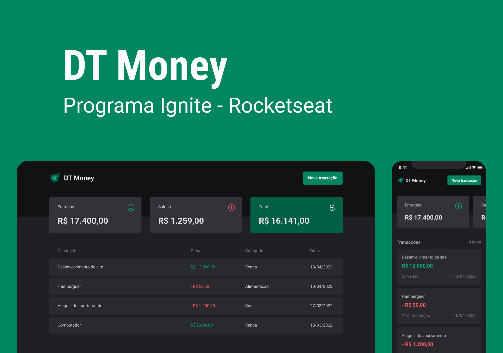

<div>
  
</div>

<br/>

## 📚 Informações sobre o projeto

- Esse projeto foi desenvolvido durante o ignite da rocketseat, Chapter 3 da trilha atualizada 2022.

&nbsp;

## 🖼️ Template do projeto Figma

- [Template do projeto original para clone](<https://www.figma.com/file/hLIxE9vFfgtr9beZd14jpK/DT-Money-(Community)?node-id=42020%3A2584&t=37VYxOIfQWoAAypK-0>)

<br/>

## 🛠️ Tecnologias/Ferramentas utilizadas

## Web

- [React](https://pt-br.reactjs.org/)
- [Vite](https://vitejs.dev/)
- [Typescript](https://www.typescriptlang.org/)
- [Styled-components](https://styled-components.com/)
- [React-Hook-Form](https://react-hook-form.com)
- [Zod](https://zod.dev/)
- [use-context-selector](https://github.com/dai-shi/use-context-selector)
- [axios](https://axios-http.com/ptbr/docs/intro)
- [phosphor-react](https://phosphoricons.com/)

## ⚙️ Instalação

```
# Abra um terminal e copie este repositório com o comando
$ git clone https://github.com/Hugovarellaa/dtmoney-2022
```

```
# Acesse a pasta da aplicação
cd dtmoney-2022

# Instale as dependências
$ yarn

# Inicie a aplicação back-end
$ yarn dev
```

---

<p align="center">Feito com 💙 por Hugo Alves Varella</p>
